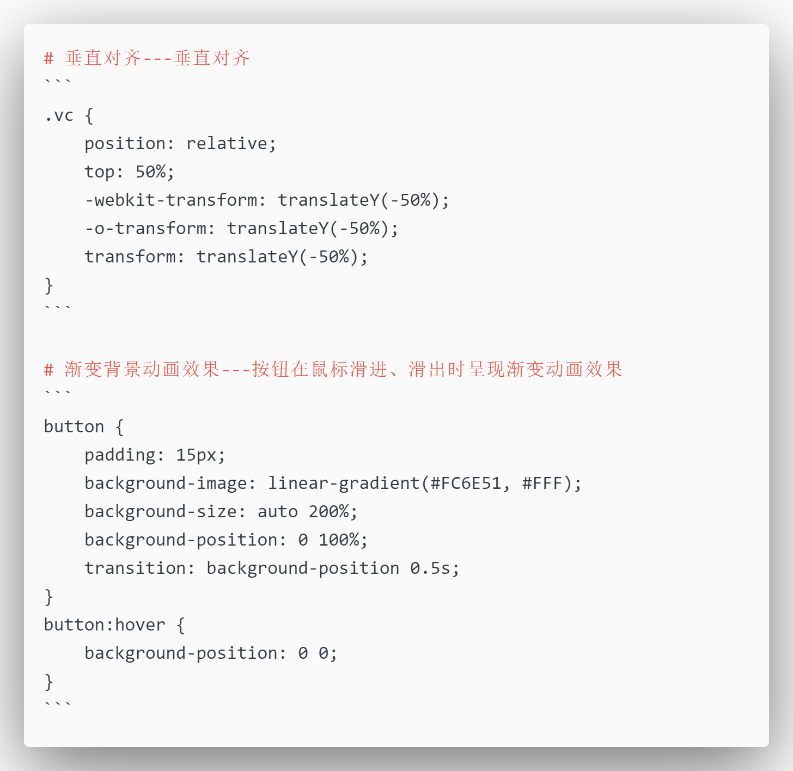

# utoolsSnippetsPaste

### 介绍
一个基于桌面端效率工具 utools 的插件，通过设定的快捷标记，将存储在 markdown 文档中的文本块快速复制、粘贴到预定位置

### 前置准备
1.  **安装 utools**：该项目是 [utools](https://u.tools/) 的一个插件，自然必须先安装 utools
2.  **Node 环境**：测试 [Node.js](https://nodejs.org/en/) 环境为 V19.17.0

### 使用说明
1.  **安装依赖**：运行 ```npm install```，安装所需以来（jsdom、marked）
2.  **加载插件**：安装好 utools 后，通过快捷键```Alt + Space```呼出 utools 框，打开插件系统，先安装、运行 utools 开发者工具，选择本插件的 plugin.json 文件，开启运行
3.  **使用插件**：重新呼出 utools 窗体，输入自己预定义的关键词，选择对应的选项，粘贴文本，如本插件中示例，在 utools 窗体中输入  c，即可使用预定义的 css 代码片段

### 预设定义规则
1. 在 plugin.json 文件中，对选项数组 features 添加 预设片段类型选项，选项对象包含如下：
	```
	{
	  "code": "css",  				// 某个具体 预设片段类型 的特定识别码
	  "cmds": ["c", "css"],			// 在 utools 窗体中触发该类型预设的关键词，支持中文
	  "explain": "css 代码集锦"		// 对该类型预设的简要描述
	},
	```
2. 在 types.js 中的导出数组中，添加 预设片段的类型名，字符串的值同上述添加的对象中的 code 值，如示例中的 "css"
3. 在 doc 文件夹下，创建一个 markdown 文件，文件名为 预设片段类型，同上述1、2 中的示例 css.md
4. 创建具体的预设片段文档，具体规则如下
	- 预设文本片段的名称与描述写在 # 开头的一级标题上，名称与描述之间必须以 ```---``` 作为分隔符
	- 具体的预设文本片段的内容放在 ```...``` 的代码块中
	- 建议：每一条文本片段之间用一个空行隔开
	- 示例：./doc/css.md 中内容如 

> **注意**:
>
> 1. 预设规则中的如下 3 个值务必设置为相同的值：
>    - plugin.json 中 features 数组，每添加的一个类型对象中的 code 值
>    - types.js 导出数组中添加的新元素值
>    - doc 文件夹下新增的预设规则的 .md 文件名
>    
> 2. doc 文件夹下的 md 文件中，每一条预设的名称与描述之间必须以英文状态下的三个短横线 ```---``` 为分隔符（前后两端没有空格）   